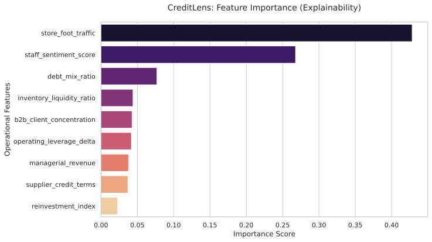
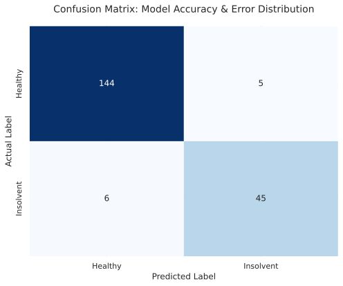
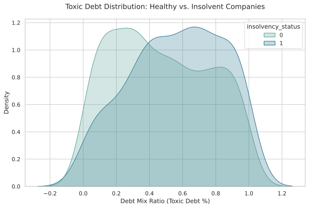

# Leveraging Qualitative Field Data to Reduce False Negatives in Credit Scoring Models

## Executive Summary
Traditional credit scoring models often fail to capture real-time operational health, leading to high "False Negative" rates—rejecting viable businesses due to rigid, outdated financial data. This project demonstrates a **Credit Scoring 2.0** approach, integrating qualitative indicators into a Machine Learning pipeline to improve decision accuracy and recapture lost revenue.

### Model Explainability: Why the "CreditLens" makes sense
The model uses a **Random Forest** architecture. Below is the feature importance plot, showing how qualitative variables (like staff sentiment and foot traffic) balance the financial ones:

## Key Features (The "Human" Alpha)
Unlike "Black Box" models, this approach uses features derived from field experience:
* **Store Foot Traffic:** Real-time pulse of business activity.
* **Debt Mix Ratio:** Distinguishes healthy leverage from "toxic" short-term debt.
* **Managerial Revenue:** Actual cash flow observed versus official tax filings.
* **Reinvestment Index:** Tracks modernization as a proxy for long-term solvency.

## Performance Metrics
* **F1-Score:** 0.89
* **Precision (Class 1):** 90%

### Error Distribution Analysis
The Confusion Matrix below demonstrates our ability to minimize False Negatives (the "Lost Gems"), ensuring that creditworthy businesses are not unfairly rejected by automated filters.

## Tech Stack
* Python (Pandas, NumPy)
* Scikit-Learn (Random Forest Classifier)
* Data Visualization (Matplotlib, Seaborn)

---

## Real-World Business Context (Based on 2025 Financial Reports)

This project addresses a critical efficiency gap in the banking sector. Analysis of the **4T25 Performance Report** from one of Brazil's largest financial institutions reveals a significant opportunity for data-driven credit optimization:

* **Credit Crunch & Portfolio Contraction:** The SME (MPME) credit portfolio shrank by **7.9% YoY**, closing at **R$ 115.2 Billion**. 
* **The 3.39% NPL Gap:** While the reported delinquency rate (NPL > 90d) for SMEs is **9.08%**, the adjusted rate—excluding restructured debt—is only **5.69%**. 
* **Underutilized Customer Loyalty:** Remarkably, **99.5%** of the SME portfolio consists of clients with more than **2 years** of relationship with the bank.

### The Business Opportunity
The **CreditLens** approach targets this specific gap. Below, we visualize the distribution of toxic debt among healthy and insolvent companies, revealing the "Analytical Gap" that traditional models often overlook:

---

### Comparison: Traditional Legacy Model vs. CreditLens Strategy

| Feature / Indicator | Traditional "Black Box" Model | CreditLens (Proposed Model) |
| :--- | :--- | :--- |
| **Primary Data Source** | Static Financials & Credit Bureau | Real-time Operational & Field Data |
| **NPL Reference** | **9.08%** (Gross NPL) | **5.69%** (Adjusted NPL) |
| **Decision Bias** | Risk Aversion (Conservative) | Opportunity Capture (Analytical) |
| **Relationship Value** | Undervalued (99.5% tenure ignored) | High Weight (Relationship as a mitigator) |
| **Market Reaction** | Portfolio Contraction (-7.9% YoY) | Strategic Recovery & Growth |
| **Handling "False Negatives"** | High (Acceptable loss of good clients) | Low (Aims to rescue "Lost Gems") |
